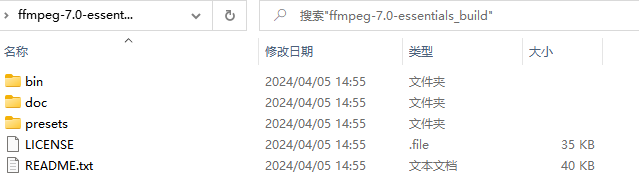
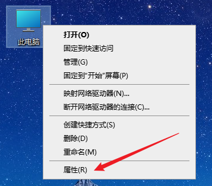
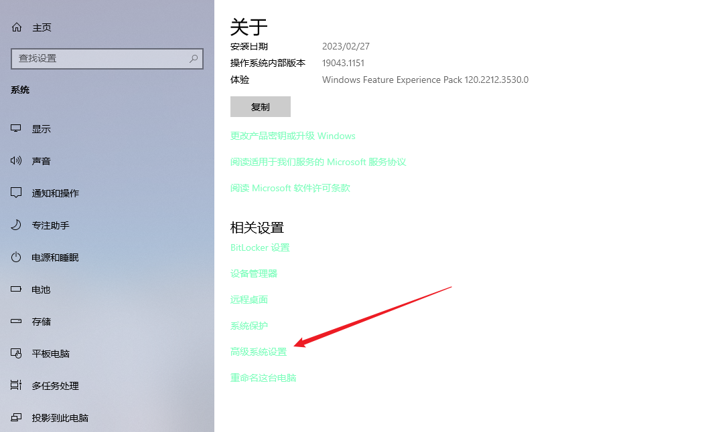
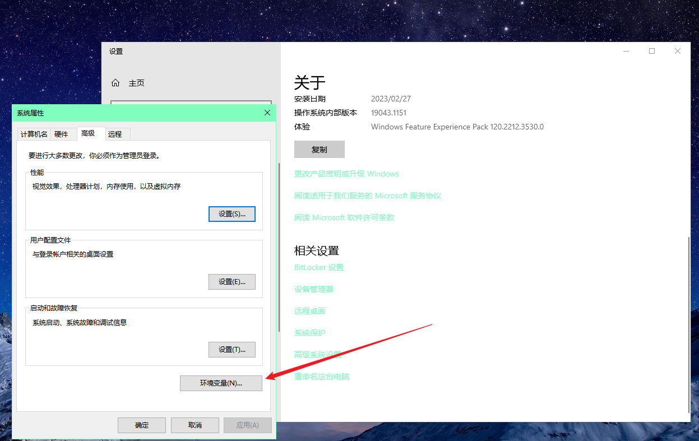
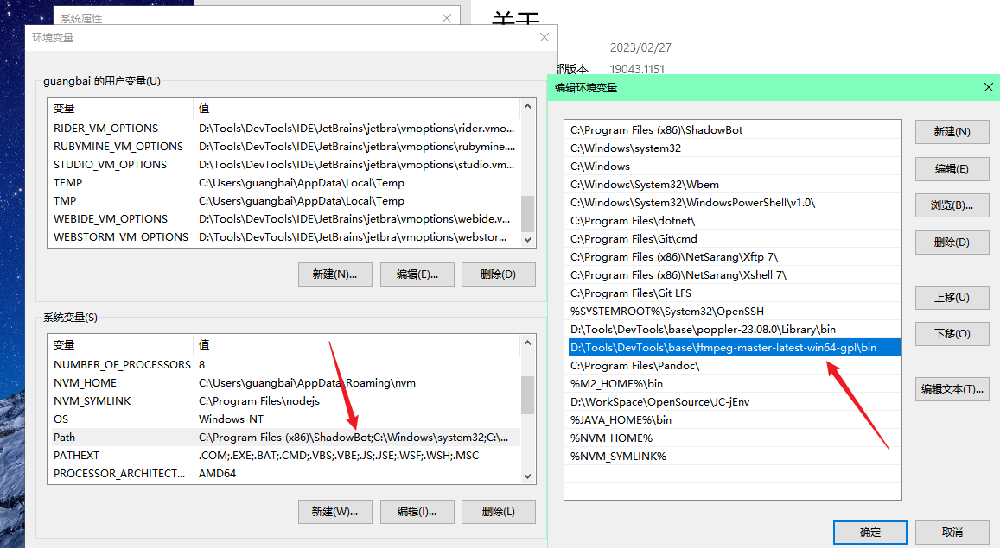
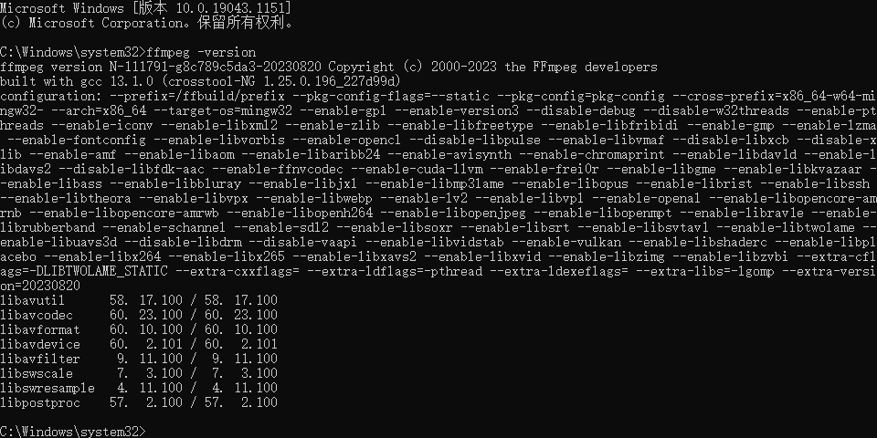

# 多媒体播放器

## 简介
基于大部分软件要么只能看图片，要么只能看视频的局限性，开发了本软件。可以自由浏览电脑上的图片或者视频，而不需要切换多个软件。视频播放功能还附带了截图和剪切视频的功能。

## 环境依赖

### 解码器

需要安装解码器，首先需要下载解码器，下载地址为：

`https://github.com/Nevcairiel/LAVFilters/releases`

选择合适版本下载即可。

### ffmpeg
ffmpeg的官方网站是：

`http://ffmpeg.org/`

可在Windows可用版本的下载地址列表页面选择需要的版本：

`https://www.gyan.dev/ffmpeg/builds/`

Window版本下载地址：

`https://github.com/BtbN/FFmpeg-Builds/releases/download/latest/ffmpeg-master-latest-win64-gpl.zip`

ffmpeg安装:

下载完成后直接进行解压，然后配置环境变量

如下，配置为自己的ffmpeg解压路径即可

ffmpeg安装成功验证：

打开命令提示符窗口。输入命令“ffmpeg –version”。如果命令提示窗口返回FFmpeg的版本信息，那么就说明安装成功了。

## 软件运行

下载代码后双击以下文件即可运行

