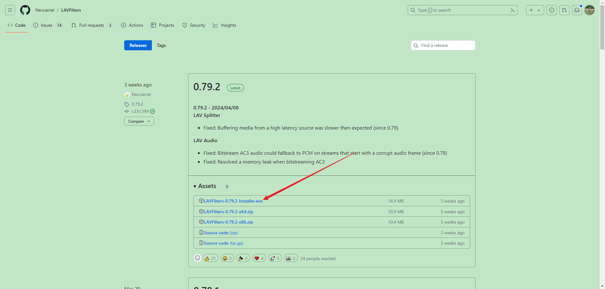

# 多媒体播放器

## 简介
基于大部分软件要么只能看图片，要么只能看视频的局限性，开发了本软件。可以自由浏览电脑上的图片或者视频，而不需要切换多个软件。视频播放功能还附带了截图和剪切视频的功能。

## 环境依赖
Python 3.9.13

### 解码器

需要安装解码器，首先需要下载解码器，下载地址为：

`https://github.com/Nevcairiel/LAVFilters/releases`

下载举例如下

选择合适版本下载即可，下载后双击文件安装。

## 软件运行

下载代码后双击以下文件即可运行

## 感谢

您的鼓励是我的动力，一块两块不嫌少，感谢您的赞助

